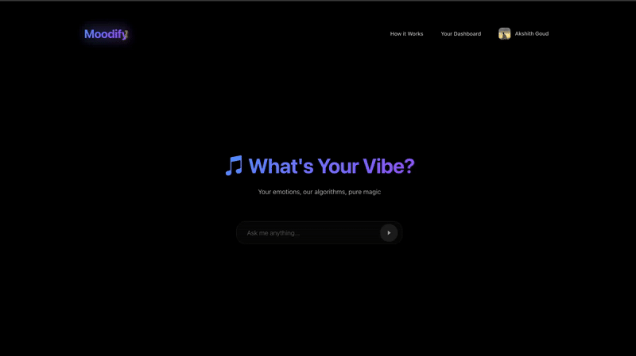

# Moodify - Music Discovery

**Transform your mood into the perfect playlist with AI-powered music recommendations using Spotify and advanced language models.**

[](https://moodify-topaz.vercel.app/)
[](https://github.com/AKSHITHGOUD9/Moodify)

## What Makes Moodify Special

- **AI-Powered Recommendations**: Uses GPT-4o, Gemini, and Hugging Face for intelligent music curation
- **Smart History Filtering**: Analyzes your Spotify listening history to find relevant tracks  
- **Multi-LLM Load Balancing**: Automatically routes queries to the best AI model
- **Real-time Playlist Creation**: Create and save playlists directly to Spotify
- **Beautiful Analytics Dashboard**: Spotify-inspired design with interactive charts
- **Global Music Support**: Works with regional music (Tamil, Telugu, Hindi, etc.)

## Live Demo

**Try it now:** [https://moodify-topaz.vercel.app/](https://moodify-topaz.vercel.app/)

## Demo Videos

Watch these videos to see Moodify in action:

### 1. **Spotify Login & Setup**

**What you'll see:** Complete Spotify OAuth login process and user profile setup.

### 2. **Analytics Dashboard & How It Works**

**What you'll see:** Interactive analytics dashboard, charts, and "How It Works" modal explanation.

### 3. **AI Recommendations & Playlist Creation**

**What you'll see:** AI-powered recommendations, smart history filtering, track selection, and playlist creation.

### 4. **Spotify Integration**

**What you'll see:** How quickly (5-10 seconds) your created playlist appears in Spotify.

---
## Tech Stack

- **Frontend**: React, Vite, Chart.js
- **Backend**: FastAPI, Python
- **AI Models**: OpenAI GPT-4o, Google Gemini, Hugging Face
- **Music API**: Spotify Web API
- **Authentication**: Spotify OAuth 2.0

## Quick Start - Run Locally

### Prerequisites
- Python 3.8+
- Node.js 16+
- Spotify Developer Account
- OpenAI API Key (optional)
- Google AI API Key (optional)
- Hugging Face API Key (optional)

### 1. Clone the Repository

**Option A: Quick Clone (Recommended - No Git LFS needed)**
```bash
# Clone without demo files (faster, smaller download)
git clone --filter=blob:none --sparse https://github.com/AKSHITHGOUD9/Moodify.git
cd Moodify
git sparse-checkout set --no-cone '/*' '!demos'
```

**Option B: Full Clone (Only if you want demo files)**
```bash
# Clone with all files including demo GIFs
git clone https://github.com/AKSHITHGOUD9/Moodify.git
cd Moodify
git lfs install  # Only needed if you want demo files
git lfs pull     # Only needed if you want demo files
```

> 💡 **Most users should use Option A** - no Git LFS installation required, gets all the code you need!

### 2. Backend Setup

```bash
# Navigate to backend
cd backend-openai

# Create virtual environment
python3 -m venv venv
source venv/bin/activate  # On Windows: venv\Scripts\activate

# Install dependencies
pip install -r requirements.txt

# Create environment file
cp env.example .env
```

### 3. Configure Environment Variables

Edit `backend-openai/.env`:

```env
# Spotify Configuration
SPOTIFY_CLIENT_ID=your_spotify_client_id
SPOTIFY_CLIENT_SECRET=your_spotify_client_secret
SPOTIFY_REDIRECT_URI=http://127.0.0.1:3000/callback
POST_LOGIN_REDIRECT=http://127.0.0.1:5173/

# AI Configuration (Optional - system works with just Spotify)
OPENAI_API_KEY=your_openai_api_key
GOOGLE_AI_API_KEY=your_google_ai_api_key
HUGGING_FACE_KEYS=your_huggingface_api_key

# Server Configuration
PORT=3000
```

### 4. Frontend Setup

```bash
# Navigate to frontend
cd ../moodify-web

# Install dependencies
npm install

# Create environment file
echo "VITE_BACKEND_URL=http://127.0.0.1:3000" > .env
```

### 5. Spotify App Configuration

1. Go to [Spotify Developer Dashboard](https://developer.spotify.com/dashboard)
2. Create a new app
3. Add redirect URI: `http://127.0.0.1:3000/callback`
4. Copy Client ID and Client Secret to your `.env` file

### 6. Run the Application

**Terminal 1 - Backend:**
```bash
cd backend-openai
source venv/bin/activate
python main.py
```

**Terminal 2 - Frontend:**
```bash
cd moodify-web
npm run dev
```

### 7. Access the Application

- **Frontend**: http://127.0.0.1:5173
- **Backend**: http://127.0.0.1:3000

## How It Works

1. **Connect Spotify**: Authenticate with your Spotify account
2. **AI Analysis**: Our AI analyzes your listening history and creates a personalized profile
3. **Smart Search**: Type natural queries like "chill old Telugu songs"
4. **AI Recommendations**: Get specific song recommendations based on your taste
5. **Create Playlists**: Select tracks and create playlists directly in Spotify

## Features Explained

### AI-Powered Recommendations
- Uses multiple LLM models (GPT-4o, Gemini, Hugging Face)
- Generates specific song titles, not generic terms
- Filters recommendations based on your listening history

### Smart History Filtering
- Analyzes your Spotify data to understand your taste
- Shows relevant tracks from your history
- Supports regional music and multiple languages

### Analytics Dashboard
- Beautiful Spotify-inspired design
- Interactive charts and visualizations
- Album cover backgrounds for visual appeal

### Playlist Creation
- Drag-and-drop track reordering
- Custom track selection
- Direct Spotify integration

## API Keys Setup (Optional)

### OpenAI (Recommended)
1. Get API key from [OpenAI Platform](https://platform.openai.com/api-keys)
2. Add to `.env` as `OPENAI_API_KEY`

### Google AI (Recommended)
1. Get API key from [Google AI Studio](https://makersuite.google.com/app/apikey)
2. Add to `.env` as `GOOGLE_AI_API_KEY`

### Hugging Face (Optional)
1. Get API key from [Hugging Face](https://huggingface.co/settings/tokens)
2. Add to `.env` as `HUGGING_FACE_KEYS`

**Note:** The system works with just Spotify API, but AI keys provide better recommendations.

## Troubleshooting

### Common Issues

**Port Already in Use:**
```bash
# Kill process on port 3000
lsof -ti:3000 | xargs kill -9

# Kill process on port 5173
lsof -ti:5173 | xargs kill -9
```

**Spotify Redirect URI Error:**
- Ensure `http://127.0.0.1:3000/callback` is added to your Spotify app settings
- Check that your `.env` file has the correct redirect URI

**Module Not Found Errors:**
```bash
# Reinstall dependencies
cd backend-openai
pip install -r requirements.txt

cd ../moodify-web
npm install
```

## Project Structure

```
Moodify/
├── backend-openai/          # FastAPI backend
│   ├── main.py             # Main application file
│   ├── requirements.txt    # Python dependencies
│   └── .env               # Environment variables
├── moodify-web/           # React frontend
│   ├── src/
│   │   ├── App.jsx        # Main React component
│   │   └── components/    # React components
│   └── package.json       # Node dependencies
└── README.md              # This file
```

## Contributing

1. Fork the repository
2. Create a feature branch
3. Make your changes
4. Submit a pull request

## Acknowledgments

- Spotify for the amazing Web API
- OpenAI, Google, and Hugging Face for AI capabilities
- React and FastAPI communities

---